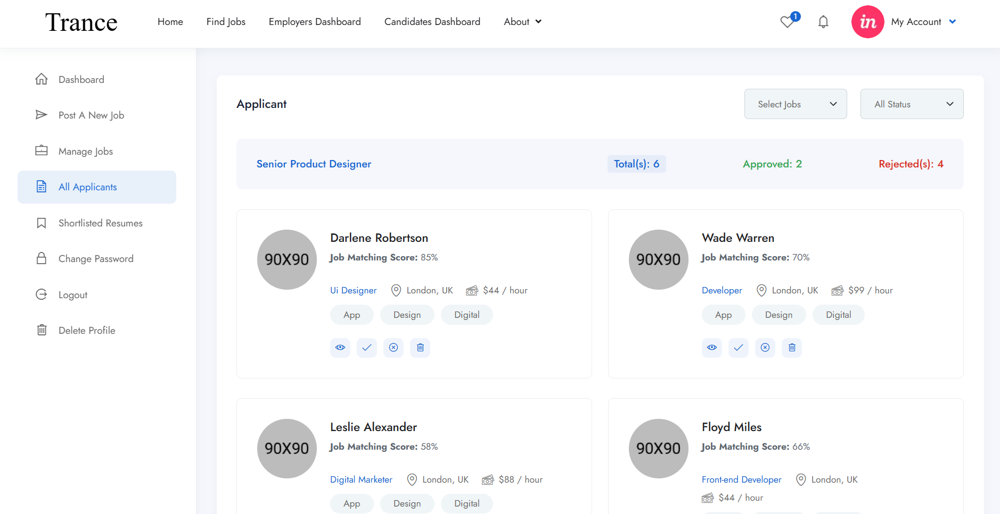
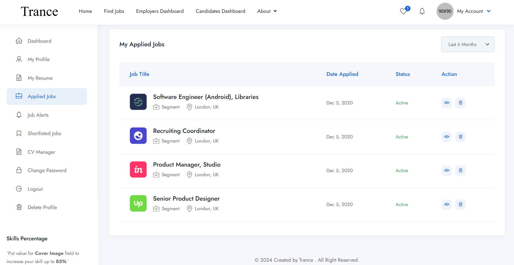
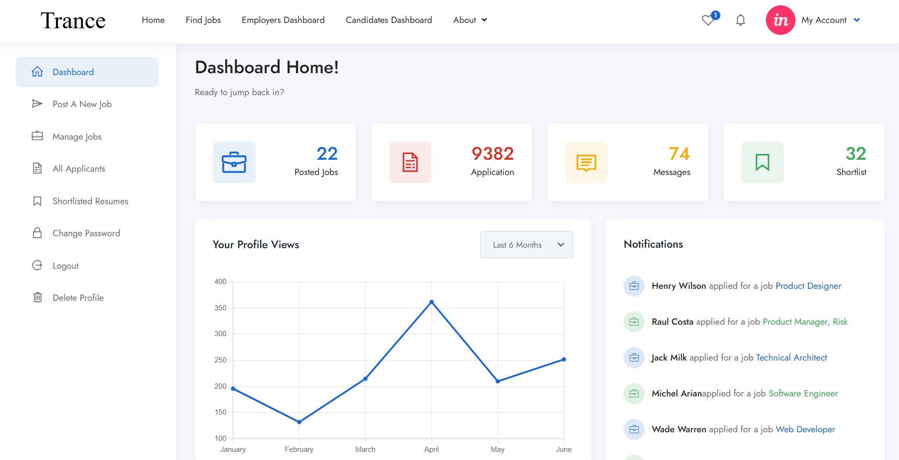
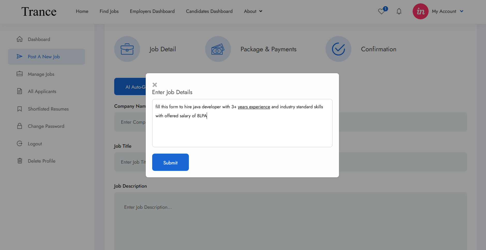

# Trance - Smart Recruiting Platform

## Description
Trance is an innovative recruiting platform designed to streamline the hiring process using advanced AI algorithms. Our platform enhances the recruitment experience for both recruiters and candidates, ensuring efficient and effective hiring.

## Project Live Link🌱
https://main.d3ephh2lbmu2zf.amplifyapp.com/

## Key Features

- **Intuitive and User-Friendly**: Enjoy a sleek, easy-to-navigate interface that simplifies the recruitment process for both candidates and recruiters. With a clean design and straightforward functionality, finding the right candidates or applying for jobs has never been easier.
  
  

- **Automated Applicant Tracking**: Streamline the application process with automated tracking and filtering, saving you time and effort.
  
  

- **Engaging Candidate Experience**: Provide a seamless and positive candidate experience with personalized communication and easy-to-use tools.
  
  

- **Data-Driven Insights**: Gain valuable insights into your hiring process with detailed analytics and reporting, helping you make informed decisions.
  
  

- **AI-Assisted Form Filling**: Our intelligent AI assistant helps recruiters fill forms automatically with prompts based on different job roles, reducing manual data entry and ensuring accuracy.
  
  
  
- **AI-Assisted Chat Support**: AI assisted chat support helps in resolving job related queries and help to solve any issues in the hiring process and also provides any details about the recruitment process or the company.

   [AI-Assisted Chat Support](images/7.png)
## Installation

To install the project, clone the repository:

```bash
git clone https://github.com/sriramsenthill/trance.git
```
## Setting Up Your MERN Stack Project: Trance

### Prerequisites
Before we begin, ensure you have the following installed:

- **Node.js and npm**: Download and install the latest version from [nodejs.org](https://nodejs.org/en). Note that npm (Node Package Manager) is included with Node.js installation and is essential for managing project dependencies.
  
- **Git**: Download and install Git from [git-scm.com](https://git-scm.com/downloads). Git is necessary for version control and cloning the project repository.

- **MongoDB**: Ensure you have MongoDB installed locally or set up an account with a cloud provider like MongoDB Atlas. This database is crucial for storing application data.

- **A Code Editor**: We recommend Visual Studio Code, but you can use any editor of your choice that supports JavaScript development.

- **A Terminal or Command Prompt**: This is where you'll execute most of the commands during setup and development.

### 1. Create a New Project Directory
Open your terminal and navigate to the desired location for your project:
```bash
mkdir trance-project
cd trance-project
```

### 2. Clone the Project from GitHub
Clone the project repository using Git:
```bash
git clone https://github.com/sriramsenthill/trance.git
```

### 3. Install Dependencies
Install the necessary dependencies for your MERN stack project:
1. Open the `client` directory:
   ```bash
   cd trance-project/trance/client
   ```
3. Run this command to install dependencies:
   ```bash
   npm i --legacy-peer-deps
   ```
4. Once the installation is complete, go to the `server` directory:
   ```bash
   cd trance-project/trance/server
   ```
5. Run the command to install client dependencies:
   ```bash
   npm i
   ```
6. Install `bcryptjs` for password hashing:
   ```bash
   npm install bcryptjs
   ```

### 4. Start the Development Server
1. Go back to the `Server` directory and run:
   ```bash
   npm run dev
   ```
2. Open another terminal window, navigate to the `client` directory again, and run:
   ```bash
   npm run dev
   ```

This should start both the client and server on your local host at ports 3000 (server) and 3001 (client).

---

With these steps, you're set up to utilize Trance effectively in your development environment!

